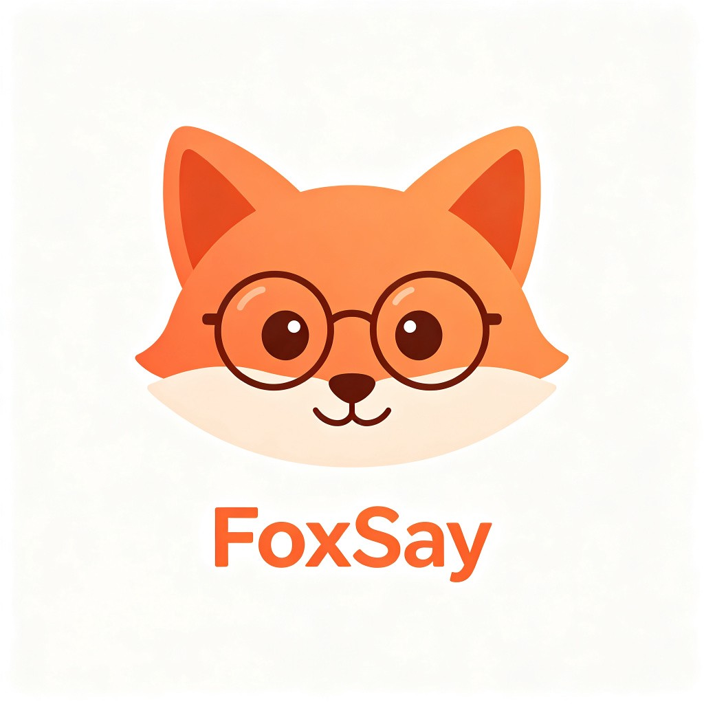
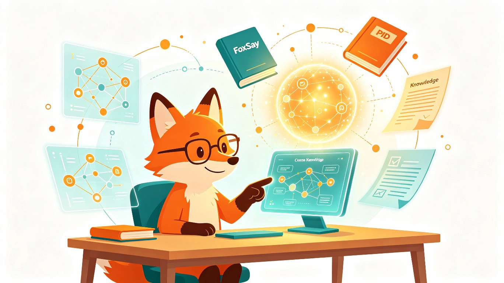
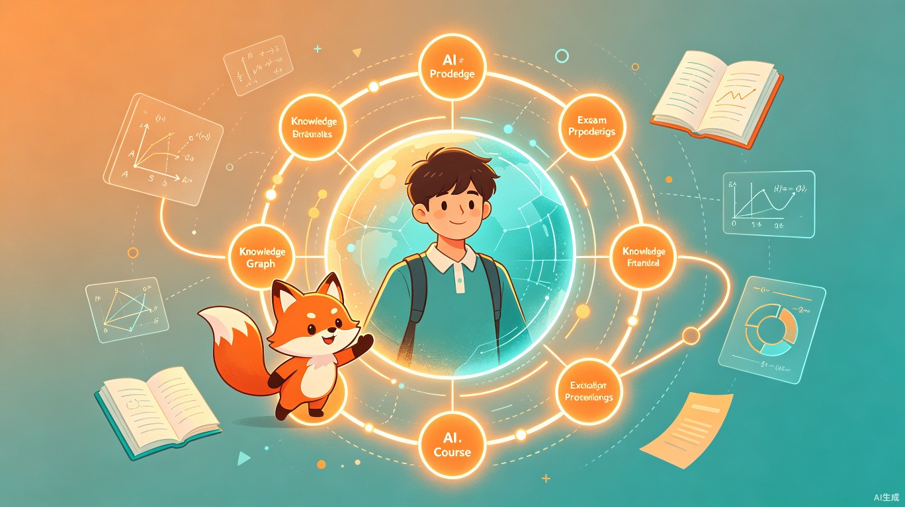

<br>

<p align="center">
  
</p>

<h1 align="center">
  <span style="color: #F59E0B;">Fox</span><span style="color: #111317;">Say</span>
</h1>

<p align="center">
  <strong style="font-size: 1.3em; color: #E8651A;">啃完一门课，带你过期末</strong>
</p>

<p align="center" style="color: #7A7A8E; font-size: 1.05em; max-width: 600px; margin: 0 auto;">
  面向中国本科生的课程级 AI 学习 Copilot<br>
  材料优先 · 来源引用 · 透明补充 · 诚实边界
</p>

<br>

<p align="center">
  
  
  
  
</p>

<br>

<p align="center">
  
</p>

<br>

---

## FoxSay 是什么？

FoxSay 不是通用问答工具，是以**「课程」为原子单位**的 AI 学习 Copilot。每门课完全隔离——材料、向量检索、骨架图、对话历史、复习计划都绑定 `course_id`。AI 优先基于你上传的课程材料回答，材料不足时透明补充通用知识并标注来源可信度，每条回答都带来源引用。

<table>
<tr>
<td width="33%" align="center" style="background: #FFF7ED; border-radius: 12px; padding: 1.5rem;">
<div style="font-size: 2em;">🎯</div>
<h3 style="color: #E8651A; margin: 0.5rem 0;">课程边界</h3>
<p style="color: #7A7A8E; font-size: 0.9em; margin: 0;">材料优先回答课程内问题<br>不足时透明补充，标注来源可信度</p>
</td>
<td width="33%" align="center" style="background: #FFF7ED; border-radius: 12px; padding: 1.5rem;">
<div style="font-size: 2em;">📚</div>
<h3 style="color: #E8651A; margin: 0.5rem 0;">材料驱动</h3>
<p style="color: #7A7A8E; font-size: 0.9em; margin: 0;">每条回答带来源引用<br>能定位到具体文件和章节</p>
</td>
<td width="33%" align="center" style="background: #FFF7ED; border-radius: 12px; padding: 1.5rem;">
<div style="font-size: 2em;">🦊</div>
<h3 style="color: #E8651A; margin: 0.5rem 0;">狐狸陪伴</h3>
<p style="color: #7A7A8E; font-size: 0.9em; margin: 0;">不是冷冰冰的问答机器<br>是陪你啃书的调皮学长/学姐</p>
</td>
</tr>
</table>

---

## 功能一览

<table>
<tr>
<td width="50%" style="padding: 1rem;">
<div style="font-size: 1.5em;">📥</div>
<h3 style="margin: 0.3rem 0; color: #111317;">课程导入</h3>
<p style="color: #7A7A8E; font-size: 0.9em; margin: 0;">CSV/Excel 课程表导入，自动建立书架和考试倒计时；也支持手动创建课程作为兜底。</p>
</td>
<td width="50%" style="padding: 1rem;">
<div style="font-size: 1.5em;">📄</div>
<h3 style="margin: 0.3rem 0; color: #111317;">智能材料处理</h3>
<p style="color: #7A7A8E; font-size: 0.9em; margin: 0;">MinerU V4 云端解析（公式/表格/图片 OCR），语义感知切块，支持 PDF/PPT/Word/图片/文本，Ctrl+V 直接粘贴截图。</p>
</td>
</tr>
<tr>
<td width="50%" style="padding: 1rem;">
<div style="font-size: 1.5em;">🗺️</div>
<h3 style="margin: 0.3rem 0; color: #111317;">课程骨架图</h3>
<p style="color: #7A7A8E; font-size: 0.9em; margin: 0;">材料处理完成后自动生成章节、核心概念、难点和先修链路，一眼看清知识结构。</p>
</td>
<td width="50%" style="padding: 1rem;">
<div style="font-size: 1.5em;">💬</div>
<h3 style="margin: 0.3rem 0; color: #111317;">课程内问答</h3>
<p style="color: #7A7A8E; font-size: 0.9em; margin: 0;">CRAG 置信度门控 + 全语义检索；材料充足时精确引用，不足时透明补充并标注来源。</p>
</td>
</tr>
<tr>
<td width="50%" style="padding: 1rem;">
<div style="font-size: 1.5em;">🧠</div>
<h3 style="margin: 0.3rem 0; color: #111317;">11 工具 ReAct Agent</h3>
<p style="color: #7A7A8E; font-size: 0.9em; margin: 0;">7 个静态工具 + 4 个动态 Skill：讲义生成、练习题、闪卡、概念图谱，随叫随到。</p>
</td>
<td width="50%" style="padding: 1rem;">
<div style="font-size: 1.5em;">🕸️</div>
<h3 style="margin: 0.3rem 0; color: #111317;">知识图谱</h3>
<p style="color: #7A7A8E; font-size: 0.9em; margin: 0;">ReactFlow + dagre 可视化章节知识网络，概念之间的先修关系一目了然。</p>
</td>
</tr>
<tr>
<td width="50%" style="padding: 1rem;">
<div style="font-size: 1.5em;">📝</div>
<h3 style="margin: 0.3rem 0; color: #111317;">课程笔记</h3>
<p style="color: #7A7A8E; font-size: 0.9em; margin: 0;">聊天回答一键保存为笔记，自动进入向量索引，后续问答可检索引用。</p>
</td>
<td width="50%" style="padding: 1rem;">
<div style="font-size: 1.5em;">🔥</div>
<h3 style="margin: 0.3rem 0; color: #111317;">超级备考模式</h3>
<p style="color: #7A7A8E; font-size: 0.9em; margin: 0;">根据考试日期生成复习计划，状态化陪伴复习，讲一节、练一题、总结一下；支持 <code>/btw</code> 随时插话。</p>
</td>
</tr>
</table>

---

## 两种模式

### 日常学习

<p align="center">
  
</p>

三栏 NotebookLM 风格布局：左边书架和课程列表，中间对话工作区，右边来源面板和 Studio 工具。材料消化完后，骨架图、知识图谱、笔记随时切换。

### 超级备考

<p align="center">
  
</p>

考试倒计时挂在顶部。狐狸根据剩余天数帮你拆复习计划，每天带你过几个概念，讲完就出题，做完再总结。临时想到什么问题，输入 `/btw` 随时插，不打断复习节奏。

---

## 快速开始

### 方式一：Docker Compose（推荐）

```bash
# 1. 复制环境变量模板，填入 DeepSeek API Key + MinerU Token
cp examples/env.example .env

# 2. 一键启动（前端 + 后端 + Qdrant）
docker compose -f infra/docker-compose.yml up --build
```

启动后访问：

| 服务 | 地址 |
|------|------|
| 前端 | http://localhost:3000 |
| 后端 API 文档 | http://localhost:8000/docs |
| Qdrant 面板 | http://localhost:6333/dashboard |

### 方式二：本地开发

```bash
# 后端（FastAPI + uv）
cd backend && uv sync && uv run uvicorn app.main:app --reload

# 前端（Vite + React）
cd frontend && npm install && npm run dev
```

> Qdrant 向量数据库默认使用本地文件模式（无需 Docker）。如需远程模式，设置 `QDRANT_URL=http://host:port`。

---

## 技术栈

<p align="center">
  <table>
  <tr>
  <td align="center" width="160" style="border: 1px solid #E8DDD0; border-radius: 12px; padding: 1rem;">
    <div style="font-size: 2em;">⚛️</div>
    <strong>Frontend</strong>
    <p style="color: #7A7A8E; font-size: 0.85em; margin: 0.3rem 0 0;">Vite + React<br>TypeScript + Tailwind</p>
  </td>
  <td align="center" width="30" style="border: none;">
    <span style="color: #E8651A; font-size: 1.5em; font-weight: bold;">→</span>
  </td>
  <td align="center" width="160" style="border: 1px solid #E8DDD0; border-radius: 12px; padding: 1rem;">
    <div style="font-size: 2em;">⚡</div>
    <strong>Backend</strong>
    <p style="color: #7A7A8E; font-size: 0.85em; margin: 0.3rem 0 0;">FastAPI + Python 3.12<br>uv 包管理</p>
  </td>
  <td align="center" width="30" style="border: none;">
    <span style="color: #E8651A; font-size: 1.5em; font-weight: bold;">→</span>
  </td>
  <td align="center" width="160" style="border: 1px solid #E8DDD0; border-radius: 12px; padding: 1rem;">
    <div style="font-size: 2em;">🔍</div>
    <strong>Vector Store</strong>
    <p style="color: #7A7A8E; font-size: 0.85em; margin: 0.3rem 0 0;">Qdrant<br>本地模式 / Docker</p>
  </td>
  <td align="center" width="30" style="border: none;">
    <span style="color: #E8651A; font-size: 1.5em; font-weight: bold;">→</span>
  </td>
  <td align="center" width="160" style="border: 1px solid #E8DDD0; border-radius: 12px; padding: 1rem;">
    <div style="font-size: 2em;">📄</div>
    <strong>Doc Parser</strong>
    <p style="color: #7A7A8E; font-size: 0.85em; margin: 0.3rem 0 0;">MinerU V4<br>Docling + LangChain</p>
  </td>
  </tr>
  </table>
</p>

- **LLM**：DeepSeek API（V4 Flash / V4 Pro）
- **Embedding**：BAAI/bge-m3（via SiliconFlow，1024 维）
- **文档解析**：MinerU V4 云端（公式 OCR + 表格识别 + 图片提取）→ Docling（本地电子版 PDF）→ pdfplumber（兜底）
- **切块**：LangChain MarkdownHeaderTextSplitter（语义感知，表格不可分割）
- **部署基线**：Docker Compose（Qdrant 可选，默认本地文件模式）

---

## 文档处理管线

```
[用户输入]
    │
    ├── PDF ──────────→ MinerU V4（云端 OCR + 公式 + 表格）→ Docling → pdfplumber
    ├── DOCX/DOC ─────→ MinerU V4（原生支持）→ MarkItDown
    ├── PPTX/PPT ─────→ MinerU V4（原生支持）→ python-pptx
    ├── XLSX ──────────→ MarkItDown
    ├── TXT/MD ────────→ 直接读取
    └── PNG/JPG ───────→ MinerU V4（OCR）
    │
    ▼
[归一化引擎] → 页面锚定 · 表格保护 · 公式对齐 · 全局编号
    │
    ▼
[语义切块] → LangChain MarkdownHeaderTextSplitter（标题层级 + 表格不可分割）
    │
    ▼
[Embedding + Qdrant] → BGE-M3 1024 维 · heading_path 上下文
    │
    ▼
[CRAG 检索] → 全层 embedding cosine 相似度 · 置信度门控
```

---

## CRAG 边界控制

FoxSay 用 CRAG（Confidence-based RAG）做检索置信度门控：

<table>
<tr>
<td align="center" width="25%" style="background: #E6F7F5; border-radius: 10px; padding: 1rem;">
<div style="font-size: 1.5em;">🟢</div>
<strong style="color: #0D9488;">score ≥ 0.72</strong>
<p style="color: #7A7A8E; font-size: 0.85em; margin: 0.3rem 0 0;">材料充分<br>正常回答 + 来源引用</p>
</td>
<td align="center" width="25%" style="background: #FFF7ED; border-radius: 10px; padding: 1rem;">
<div style="font-size: 1.5em;">🟡</div>
<strong style="color: #F59E0B;">0.55 ≤ score < 0.72</strong>
<p style="color: #7A7A8E; font-size: 0.85em; margin: 0.3rem 0 0;">材料部分相关<br>谨慎回答 + 标注置信度</p>
</td>
<td align="center" width="25%" style="background: #FEF2F2; border-radius: 10px; padding: 1rem;">
<div style="font-size: 1.5em;">🔵</div>
<strong style="color: #3B82F6;">score < 0.55</strong>
<p style="color: #7A7A8E; font-size: 0.85em; margin: 0.3rem 0 0;">材料未覆盖<br>透明补充通用知识 + 标注来源</p>
</td>
</tr>
</table>

材料不足时 AI 不会冷冰冰地拒答，而是基于通用知识给出有帮助的回答，同时明确声明「课程材料中未覆盖此内容，建议对照教材确认」。

---

## 项目结构

```
fox-say/
├── frontend/          # Vite + React + TypeScript + Tailwind
│   └── src/
│       ├── features/  # bookshelf / course / onboarding
│       ├── components/ui/  # 基础 UI 组件
│       └── shared/    # API 客户端、类型、文案
├── backend/           # FastAPI + Python (uv + pyproject.toml)
│   └── app/
│       ├── api/       # 12 个 API 路由模块
│       ├── services/  # 21 个 service（agent/pipeline/retrieval/mineru/...）
│       ├── core/      # 配置、依赖
│       └── db/        # SQLite 存储
├── infra/             # Docker Compose（Qdrant + backend + frontend）
├── docs/              # 架构文档、CRAG 策略、管线重构计划
├── scripts/           # 工具脚本
└── assets/readme/     # README 用图
```

---

## 真相之源（Source of Truth）

所有工程约束和架构文档以这些文件为准：

| 文件 | 内容 |
|------|------|
| [AGENTS.md](AGENTS.md) | 最高优先级工程与产品约束，任何 agent 操作前必读 |
| [HANDOFF.md](HANDOFF.md) | 交接文档，记录当前状态、架构、已知问题 |
| [docs/architecture.md](docs/architecture.md) | MVP 架构总览（API 端点、Agent、管线、测试策略） |
| [docs/crag-policy.md](docs/crag-policy.md) | 检索置信度阈值与回答策略细节 |
| [docs/product-boundaries.md](docs/product-boundaries.md) | MVP 范围与优先级原则 |
| [docs/pipeline-refactor-plan.md](docs/pipeline-refactor-plan.md) | 文档管线重构计划（已完成） |

---

<br>

<p align="center">
  <span style="color: #F59E0B; font-size: 1.1em;">🦊</span>
  <br>
  <span style="color: #7A7A8E; font-size: 0.9em;">"材料扔进来，剩下的交给狐狸。"</span>
</p>

<br>
